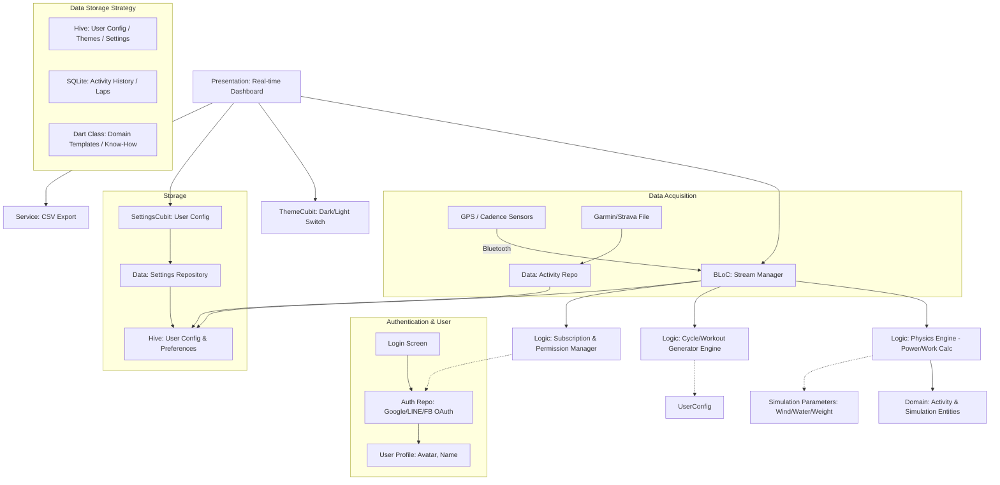
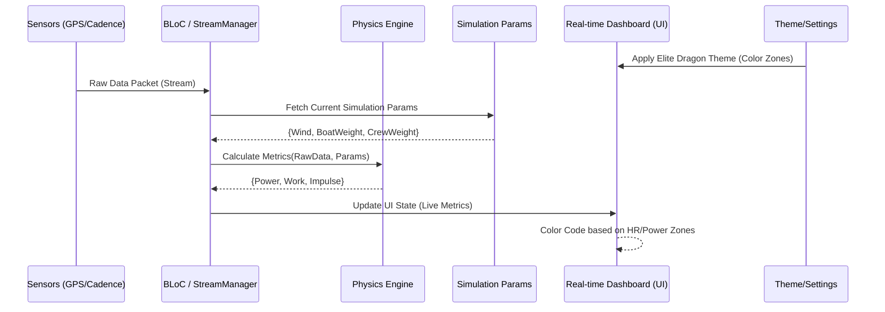
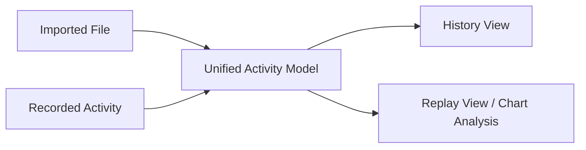
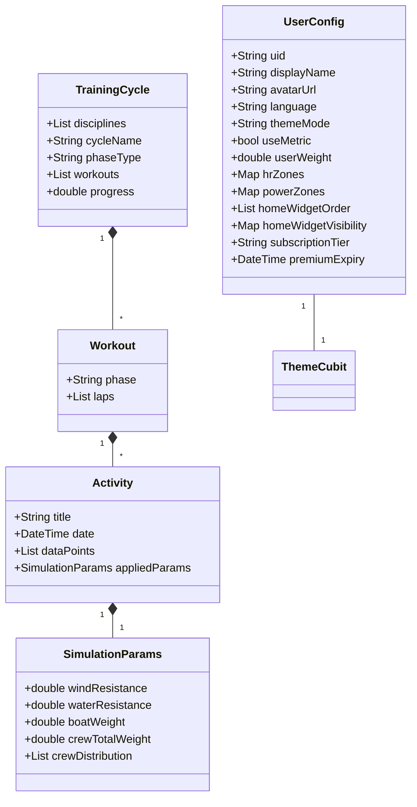

# System Design: dptapp (系統設計)

## 1. System Architecture Diagram (系統架構圖)
The architecture is optimized for low-latency data streaming and real-time physical calculations.
架構針對低延遲數據串流與實時物理計算進行了優化。

## 2. Real-time Training Feedback Flow (實時訓練回饋流程)
This sequence shows how sensor data is combined with user-defined parameters for real-time coaching.
此序列顯示傳感器數據如何與用戶定義的參數結合，以進行實時指導。

## 3. Data Consolidation: Import & Playback (數據整合：導入與回放)

## 4. Key Entities for Simulation & Personalization (核心實體：模擬與個人化)

## 5. Storage Strategy (數據管理邊界與儲存方案)

To ensure smooth operation and easy maintenance, the following storage strategy is adopted:
為了確保 App 運作流暢且便於維護，採用以下分級儲存方案：

| Data Type (數據類型) | Description (說明) | Recommended Storage (儲存方式) | Status (狀態) |
| :--- | :--- | :--- | :--- |
| **App Config** | Themes, Language, Sorting | **Hive** (Memory-cached NoSQL) | **[Implemented/已落實]** |
| **Domain Templates** | Core Training Know-How | **Dart Class** (Strongly typed) | **[Implemented/已落實]** |
| **Activity Data** | TCX, Laps, GPS Tracks | **SQLite** (sqflite) | **[Not Implemented/未落實]** |
| **AI Algorithms** | Cycle Generation | Local (Initial) / Cloud (Future) | **[In Progress/開發中]** |
| **User Settings** | Weight, HR/Power Zones | **Hive** | **[Implemented/已落實]** |

---

## 6. Refactoring Plan (專案重構計畫)

### 6.1 Feature-First Architecture (功能優先架構)
The current Layered architecture will migrate to **Feature-First** for better scalability.
目前的 Layered 架構將遷移至 **Feature-First**，以利後續功能的擴展。
- `lib/features/auth/`: Login, Permission. (登入、權限)
- `lib/features/cycle/`: Generation, Algorithm. (週期生成、演算法)
- `lib/features/training/`: Real-time, Sensors. (實時訓練、感應器)
- `lib/features/community/`: Social, Leaderboards. (社群、排行榜)
- `lib/core/`: Common Utilities & Initialization. (共用 Utility 與初始化)

### 6.2 Boundaries & Scalability (技術邊界與擴展性)
- **Cloud Functions (Serverless)**: Offload complex generation logic to protect IP.
  - **雲端運算**: 將複雜算法移至雲端，保護核心演算智財。
- **Google Drive Backup**: Asynchronous background backup to avoid data loss.
  - **雲端備份**: 利用 `googleapis` 實作背景備份，確保換機不丟失數據。

---

## 7. Design Patterns (設計模式)
- **Strategy Pattern (策略模式)**: Interchangeable physics models. (物理計算模型可動態切換)
- **Observer Pattern (觀察者模式)**: BLoC streams for real-time updates. (實時數據流訂閱)
- **State Pattern (狀態模式)**: Global theme management. (全域外觀狀態管理)
- **Command Pattern (命令模式)**: Seekable activity playback. (可快進/倒退的回放操作)
- **Proxy Pattern (代理模式)**: Subscription-based feature gating. (根據訂閱等級控制功能權限)
- **Animation (動畫框架)**: Premium Hero and Page transitions. (高級感頁面轉場)
