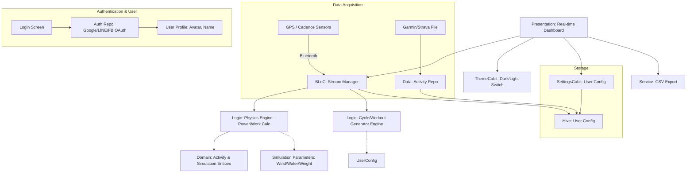
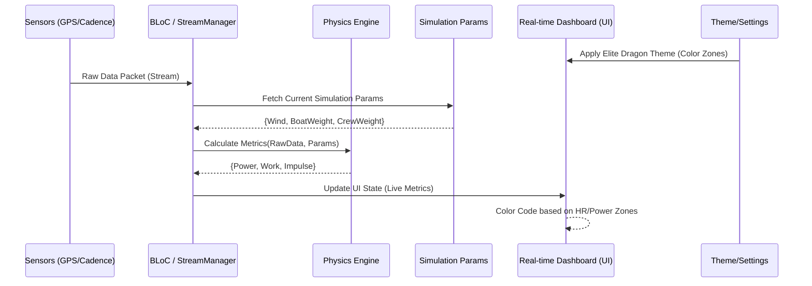
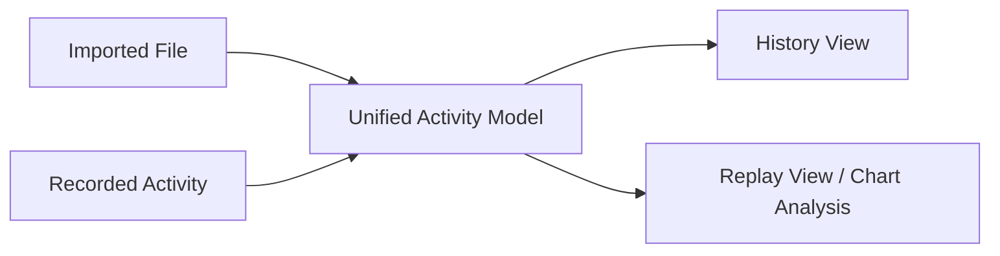
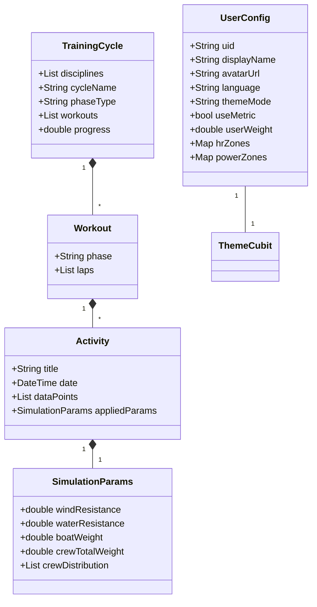

# System Design: dptapp (Refined for Dragon Boat)

## 1. System Architecture Diagram
The architecture is optimized for low-latency data streaming and real-time physical calculations.

## 2. Real-time Training Feedback Flow
This sequence shows how sensor data is combined with user-defined parameters for real-time coaching.

## 3. Data Consolidation: Import & Playback

## 4. Key Entities for Simulation & Personalization

## 5. Design Patterns Added
- **Strategy Pattern (Calculation)**: Different physics models for different boat types or environmental conditions can be swapped dynamically.
- **Observer Pattern (Streams)**: UI widgets subscribe to the BLoC data streams for millisecond-level updates.
- **State Pattern (Theme)**: `ThemeCubit` manages the application's appearance state globally.
- **Command Pattern (Playback)**: Encapsulates activity data into "seekable" commands for rewind/play functionality.
